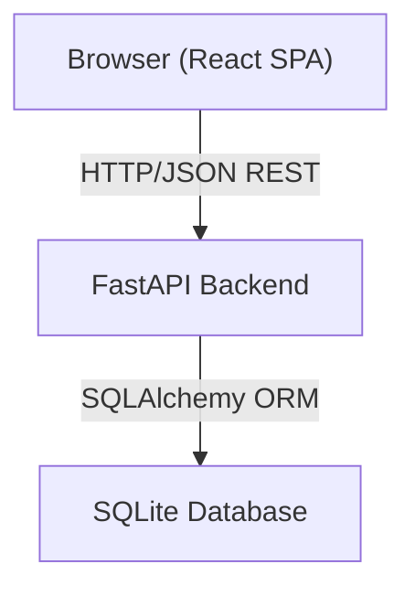
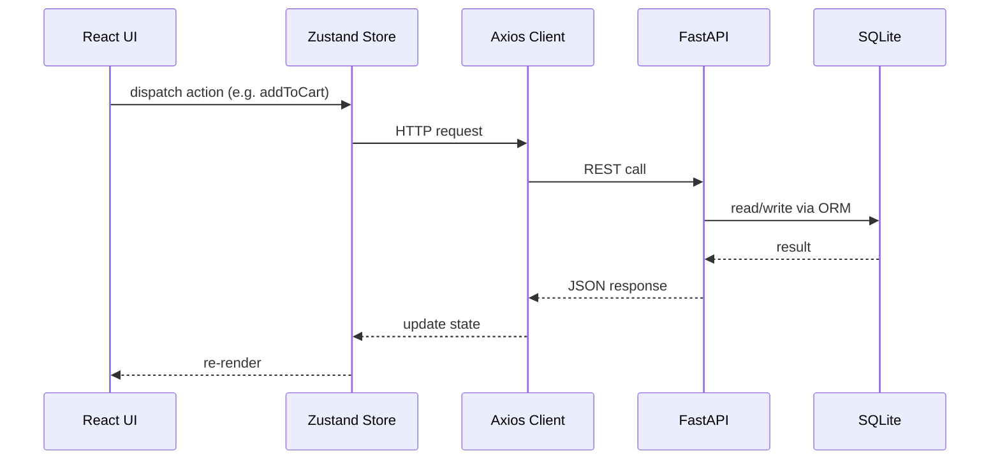

# Technical Design Document: Grocery Store Web App

## Overview

This document describes the technical design for converting a Python CLI-based Grocery Store Inventory and Billing Management System into a full-featured web application. The system exposes inventory management, cart-based purchasing, and receipt generation through a browser UI backed by a REST API.

The application follows a classic client-server architecture: a React single-page application (SPA) communicates with a FastAPI backend over HTTP/JSON. Inventory data is persisted to a SQLite database via SQLAlchemy ORM, providing durability without requiring an external database server.

### Technology Stack

| Layer | Technology | Rationale |
|---|---|---|
| Frontend | React 18 + TypeScript | Component model fits cart/inventory UI; TypeScript catches data-shape bugs early |
| Styling | Tailwind CSS | Utility-first, responsive by default, minimal bundle overhead |
| State Management | Zustand | Lightweight, no boilerplate; sufficient for cart + UI state |
| HTTP Client | Axios | Interceptors simplify global error/loading handling |
| Backend | FastAPI (Python) | Async, auto-generates OpenAPI docs, matches existing Python codebase |
| ORM | SQLAlchemy 2.x | Mature, supports SQLite and easy migration to Postgres |
| Database | SQLite (file-based) | Zero-config persistence; swap to Postgres for production |
| Testing (FE) | Vitest + fast-check | Vitest for unit/component tests; fast-check for property-based tests |
| Testing (BE) | pytest + hypothesis | pytest for unit tests; hypothesis for property-based tests |

---

## Architecture



### Request Flow



### Deployment Layout

```
grocery-store-web-app/
├── backend/
│   ├── main.py            # FastAPI app entry point
│   ├── models.py          # SQLAlchemy ORM models
│   ├── schemas.py         # Pydantic request/response schemas
│   ├── crud.py            # Database operations
│   ├── database.py        # DB engine + session factory
│   └── tests/
│       └── test_*.py
└── frontend/
    ├── src/
    │   ├── api/           # Axios client + endpoint functions
    │   ├── components/    # React components
    │   ├── store/         # Zustand stores
    │   ├── types/         # TypeScript interfaces
    │   └── tests/
    └── vite.config.ts
```

---

## Components and Interfaces

### Frontend Components

```
App
├── InventoryPage
│   ├── SearchBar            # debounced text input (300ms)
│   ├── InventoryTable       # sortable, paginated table
│   │   └── ItemRow          # row with edit action + low-stock highlight
│   ├── AddItemModal         # form: name, price, stock
│   └── EditItemModal        # pre-populated form
├── PurchasePage
│   ├── CustomerNameForm     # session start
│   ├── ItemSearch           # search + add-to-cart
│   ├── CartPanel
│   │   ├── CartItem         # qty update + remove
│   │   └── CartTotal        # running total
│   └── CheckoutButton
└── ReceiptPage
    ├── ReceiptTable         # itemized bill
    └── PrintButton          # triggers window.print()
```

#### Key Component Interfaces (TypeScript)

```typescript
// InventoryTable props
interface InventoryTableProps {
  items: Item[];
  onEdit: (item: Item) => void;
  sortConfig: SortConfig;
  onSort: (column: keyof Item) => void;
}

// CartPanel props
interface CartPanelProps {
  cart: CartItem[];
  onRemove: (itemId: number) => void;
  onUpdateQty: (itemId: number, qty: number) => void;
  total: number;
}
```

### Backend Modules

| Module | Responsibility |
|---|---|
| `main.py` | Route definitions, CORS, exception handlers |
| `models.py` | SQLAlchemy `Item` table model |
| `schemas.py` | Pydantic models for request validation and response serialization |
| `crud.py` | All DB read/write logic (no SQL in routes) |
| `database.py` | Engine creation, `get_db` dependency |

### API Endpoints

| Method | Path | Description |
|---|---|---|
| `GET` | `/items` | List all items (supports `?search=`, `?sort_by=`, `?order=asc\|desc`, `?page=`, `?page_size=`) |
| `POST` | `/items` | Add new item |
| `PUT` | `/items/{id}` | Update item name/price/stock |
| `GET` | `/items/{id}` | Get single item |
| `POST` | `/checkout` | Process cart, deduct stock, return receipt |

#### Request / Response Shapes

```
POST /items
Body:  { "name": string, "price": int, "stock": int }
200:   { "id": int, "name": string, "price": int, "stock": int }
409:   { "error_code": "DUPLICATE_NAME", "message": "Item already exists" }
422:   { "error_code": "VALIDATION_ERROR", "message": "..." }

PUT /items/{id}
Body:  { "name": string, "price": int, "stock": int }
200:   { "id": int, "name": string, "price": int, "stock": int }
404:   { "error_code": "NOT_FOUND", "message": "Item not found" }

POST /checkout
Body:  { "customer_name": string, "items": [{ "item_id": int, "quantity": int }] }
200:   { "customer_name": string, "items": [...], "grand_total": int }
409:   { "error_code": "STOCK_CONFLICT", "message": "Insufficient stock for: ..." }
400:   { "error_code": "EMPTY_CART", "message": "Cart is empty" }
```

#### Structured Error Response (all errors)

```json
{
  "error_code": "STOCK_CONFLICT",
  "message": "Insufficient stock for: Apples (requested 5, available 2)"
}
```

---

## Data Models

### Database Model (SQLAlchemy)

```python
class Item(Base):
    __tablename__ = "items"

    id: Mapped[int] = mapped_column(Integer, primary_key=True, autoincrement=True)
    name: Mapped[str] = mapped_column(String(255), unique=True, nullable=False)
    price: Mapped[int] = mapped_column(Integer, nullable=False)   # stored in ₹ (whole rupees)
    stock: Mapped[int] = mapped_column(Integer, nullable=False)
```

### Pydantic Schemas

```python
class ItemCreate(BaseModel):
    name: str = Field(..., min_length=1)
    price: int = Field(..., gt=0)
    stock: int = Field(..., gt=0)

class ItemResponse(BaseModel):
    id: int
    name: str
    price: int
    stock: int

class CheckoutItem(BaseModel):
    item_id: int
    quantity: int = Field(..., gt=0)

class CheckoutRequest(BaseModel):
    customer_name: str = Field(..., min_length=1)
    items: list[CheckoutItem] = Field(..., min_length=1)

class ReceiptLineItem(BaseModel):
    name: str
    unit_price: int
    quantity: int
    line_total: int

class CheckoutResponse(BaseModel):
    customer_name: str
    items: list[ReceiptLineItem]
    grand_total: int
```

### Frontend TypeScript Types

```typescript
interface Item {
  id: number;
  name: string;
  price: number;   // whole ₹
  stock: number;
}

interface CartItem {
  item: Item;
  quantity: number;
}

interface ReceiptLineItem {
  name: string;
  unit_price: number;
  quantity: number;
  line_total: number;
}

interface Receipt {
  customer_name: string;
  items: ReceiptLineItem[];
  grand_total: number;
}
```

### Key Algorithms

**Cart total calculation** (pure function, frontend):
```typescript
const cartTotal = (cart: CartItem[]): number =>
  cart.reduce((sum, ci) => sum + ci.item.price * ci.quantity, 0);
```

**Stock deduction at checkout** (backend, inside a DB transaction):
```python
# Runs inside a single transaction; rolls back on any conflict
for checkout_item in request.items:
    db_item = db.get(Item, checkout_item.item_id, with_for_update=True)
    if db_item.stock < checkout_item.quantity:
        raise StockConflictError(db_item.name, checkout_item.quantity, db_item.stock)
    db_item.stock -= checkout_item.quantity
db.commit()
```

**Search/filter debounce** (frontend):
```typescript
// 300ms debounce on search input; filters client-side on already-fetched inventory
const debouncedSearch = useMemo(
  () => debounce((q: string) => setQuery(q), 300),
  []
);
```

**Sort toggle**:
```typescript
const toggleSort = (col: keyof Item) =>
  setSortConfig(prev =>
    prev.column === col
      ? { column: col, direction: prev.direction === 'asc' ? 'desc' : 'asc' }
      : { column: col, direction: 'asc' }
  );
```


---

## Correctness Properties

*A property is a characteristic or behavior that should hold true across all valid executions of a system — essentially, a formal statement about what the system should do. Properties serve as the bridge between human-readable specifications and machine-verifiable correctness guarantees.*

### Property 1: Search filter correctness

*For any* list of inventory items and any search query string, every item displayed after filtering must have a name that contains the query (case-insensitively), and no item whose name contains the query should be absent from the results.

**Validates: Requirements 1.3, 4.2**

---

### Property 2: Sort ordering correctness

*For any* list of inventory items and any sortable column, sorting ascending should produce a list where each adjacent pair satisfies `item[i][col] <= item[i+1][col]`; sorting descending should produce the reverse. Sorting ascending then descending should yield the same multiset as the original list.

**Validates: Requirements 1.4**

---

### Property 3: Low-stock highlight

*For any* inventory item, if its stock is less than 10 the rendered row must carry the low-stock indicator; if its stock is 10 or greater the indicator must be absent.

**Validates: Requirements 1.5**

---

### Property 4: Inventory table renders all item fields

*For any* non-empty list of inventory items, the rendered table must contain each item's name, price, and stock quantity.

**Validates: Requirements 1.1**

---

### Property 5: Add item persistence round-trip

*For any* valid item (non-empty name, positive price, positive stock), adding it via the API and then fetching the inventory should return an item with the same name, price, and stock.

**Validates: Requirements 2.2, 6.1, 6.3**

---

### Property 6: Empty or whitespace name rejected

*For any* string composed entirely of whitespace characters (including the empty string), submitting it as an item name must be rejected by validation, and the inventory must remain unchanged.

**Validates: Requirements 2.3**

---

### Property 7: Non-positive price or stock rejected

*For any* price value ≤ 0 or stock value ≤ 0, submitting the add/edit form must be rejected by validation, and the inventory must remain unchanged.

**Validates: Requirements 2.4, 3.4**

---

### Property 8: Duplicate item name rejected

*For any* item already present in the inventory, attempting to add a second item with the same name (case-sensitive) must cause the API to return a DUPLICATE_NAME error and leave the inventory unchanged.

**Validates: Requirements 2.5**

---

### Property 9: Inventory state reflects mutations

*For any* sequence of add or edit operations that each succeed, the frontend inventory state after each operation must contain exactly the item that was added or the updated values of the item that was edited, without requiring a full page reload.

**Validates: Requirements 2.6, 3.5**

---

### Property 10: Edit form pre-populated with current values

*For any* item in the inventory, opening the edit form for that item must display input fields whose values exactly match the item's current name, price, and stock.

**Validates: Requirements 3.2**

---

### Property 11: Edit item persistence round-trip

*For any* existing item and any valid update (non-empty name, positive price, positive stock), updating it via the API and then fetching that item should return the updated values.

**Validates: Requirements 3.3**

---

### Property 12: Valid cart addition

*For any* item with stock > 0 and any quantity in [1, stock], adding that item to the cart must result in the cart containing that item with the specified quantity.

**Validates: Requirements 4.3**

---

### Property 13: Over-stock quantity rejected from cart

*For any* item and any quantity strictly greater than the item's available stock, attempting to add it to the cart must be rejected and the cart must remain unchanged.

**Validates: Requirements 4.4**

---

### Property 14: Cart total invariant

*For any* cart state (including after add, remove, or quantity update), the displayed grand total must equal the sum of `item.price × quantity` for every cart line item.

**Validates: Requirements 4.5, 4.6, 4.8**

---

### Property 15: Checkout deducts stock correctly

*For any* valid checkout request (non-empty cart, all quantities within stock), after a successful checkout each item's stock in the database must be reduced by exactly the purchased quantity.

**Validates: Requirements 5.1**

---

### Property 16: Receipt renders all required fields

*For any* checkout response, the rendered receipt must contain the customer name, and for each line item: the item name, unit price, quantity, and line total; plus the grand total.

**Validates: Requirements 5.2**

---

### Property 17: Stock conflict at checkout returns error

*For any* checkout request where at least one item's requested quantity exceeds its current stock, the API must return a STOCK_CONFLICT error and must not deduct any stock.

**Validates: Requirements 5.6**

---

### Property 18: API error message displayed to user

*For any* API error response containing a `message` field, the frontend must display that message text to the user.

**Validates: Requirements 8.1**

---

### Property 19: API returns structured error on unexpected failure

*For any* unhandled exception in the API, the response must conform to the structured error schema `{ error_code: string, message: string }` with an appropriate HTTP status code.

**Validates: Requirements 8.3**

---

### Property 20: Loading state active during pending requests

*For any* API request that has been initiated but not yet resolved, the loading indicator must be visible; once the request resolves (success or error), the loading indicator must be hidden.

**Validates: Requirements 8.4**

---

## Error Handling

### Backend Error Strategy

All API errors return a consistent JSON body:

```json
{ "error_code": "SNAKE_CASE_CODE", "message": "Human-readable description" }
```

FastAPI exception handlers map domain exceptions to HTTP status codes:

| Exception | HTTP Status | error_code |
|---|---|---|
| `DuplicateNameError` | 409 | `DUPLICATE_NAME` |
| `ItemNotFoundError` | 404 | `NOT_FOUND` |
| `StockConflictError` | 409 | `STOCK_CONFLICT` |
| `EmptyCartError` | 400 | `EMPTY_CART` |
| `RequestValidationError` | 422 | `VALIDATION_ERROR` |
| Unhandled `Exception` | 500 | `INTERNAL_ERROR` |

The global 500 handler logs the full traceback server-side but returns only a safe message to the client.

### Frontend Error Strategy

Axios response interceptors catch all non-2xx responses and network failures:

```typescript
axios.interceptors.response.use(
  res => res,
  err => {
    const message = err.response?.data?.message ?? "Network error. Please check your connection.";
    useNotificationStore.getState().setError(message);
    useLoadingStore.getState().setLoading(false);
    return Promise.reject(err);
  }
);
```

- Loading state is always cleared in both success and error paths.
- Notifications are displayed in an ARIA live region (`aria-live="polite"`).
- No request leaves the UI in an indeterminate loading state.

### Stock Conflict Handling

The checkout endpoint wraps all stock deductions in a single DB transaction with row-level locking (`SELECT ... FOR UPDATE`). If any item has insufficient stock, the transaction rolls back entirely — no partial deductions occur.

---

## Testing Strategy

### Dual Testing Approach

Both unit tests and property-based tests are required. They are complementary:

- **Unit tests** cover specific examples, integration points, and edge cases (empty cart, empty inventory, network failure simulation).
- **Property-based tests** verify universal correctness across randomly generated inputs, catching edge cases that hand-written examples miss.

### Backend Testing (pytest + Hypothesis)

```
backend/tests/
├── test_crud.py          # unit tests for CRUD operations
├── test_routes.py        # integration tests for API endpoints
└── test_properties.py    # Hypothesis property-based tests
```

Property-based tests use `hypothesis` with `@given` and `@settings(max_examples=100)`.

Each property test is tagged with a comment referencing the design property:

```python
# Feature: grocery-store-web-app, Property 5: Add item persistence round-trip
@given(st.text(min_size=1), st.integers(min_value=1), st.integers(min_value=1))
@settings(max_examples=100)
def test_add_item_round_trip(name, price, stock):
    ...
```

### Frontend Testing (Vitest + fast-check)

```
frontend/src/tests/
├── components/           # component unit tests
├── store/                # Zustand store unit tests
└── properties/           # fast-check property tests
```

Property-based tests use `fast-check` with `fc.assert(fc.property(...))` and `{ numRuns: 100 }`.

Each property test is tagged:

```typescript
// Feature: grocery-store-web-app, Property 14: Cart total invariant
test("cart total invariant", () => {
  fc.assert(
    fc.property(fc.array(cartItemArbitrary), (cart) => {
      const expected = cart.reduce((s, ci) => s + ci.item.price * ci.quantity, 0);
      expect(cartTotal(cart)).toBe(expected);
    }),
    { numRuns: 100 }
  );
});
```

### Unit Test Focus Areas

- Validation logic (empty name, non-positive values, over-stock quantity)
- Error display component with mocked API errors
- Receipt rendering with a fixed receipt fixture
- Empty inventory empty-state message
- ARIA live region presence on notification component
- Axios interceptor behavior on network failure (mocked)

### Property Test Coverage Map

| Property | Test File | Library |
|---|---|---|
| P1 Search filter | `frontend/properties/search.test.ts` | fast-check |
| P2 Sort ordering | `frontend/properties/sort.test.ts` | fast-check |
| P3 Low-stock highlight | `frontend/properties/lowstock.test.ts` | fast-check |
| P4 Table renders fields | `frontend/properties/table.test.ts` | fast-check |
| P5 Add item round-trip | `backend/tests/test_properties.py` | hypothesis |
| P6 Empty name rejected | `frontend/properties/validation.test.ts` | fast-check |
| P7 Non-positive rejected | `frontend/properties/validation.test.ts` | fast-check |
| P8 Duplicate name rejected | `backend/tests/test_properties.py` | hypothesis |
| P9 State reflects mutations | `frontend/properties/store.test.ts` | fast-check |
| P10 Edit form pre-populated | `frontend/properties/editform.test.ts` | fast-check |
| P11 Edit round-trip | `backend/tests/test_properties.py` | hypothesis |
| P12 Valid cart addition | `frontend/properties/cart.test.ts` | fast-check |
| P13 Over-stock rejected | `frontend/properties/cart.test.ts` | fast-check |
| P14 Cart total invariant | `frontend/properties/cart.test.ts` | fast-check |
| P15 Checkout deducts stock | `backend/tests/test_properties.py` | hypothesis |
| P16 Receipt renders fields | `frontend/properties/receipt.test.ts` | fast-check |
| P17 Stock conflict error | `backend/tests/test_properties.py` | hypothesis |
| P18 Error message displayed | `frontend/properties/errors.test.ts` | fast-check |
| P19 Structured error response | `backend/tests/test_properties.py` | hypothesis |
| P20 Loading state | `frontend/properties/loading.test.ts` | fast-check |
